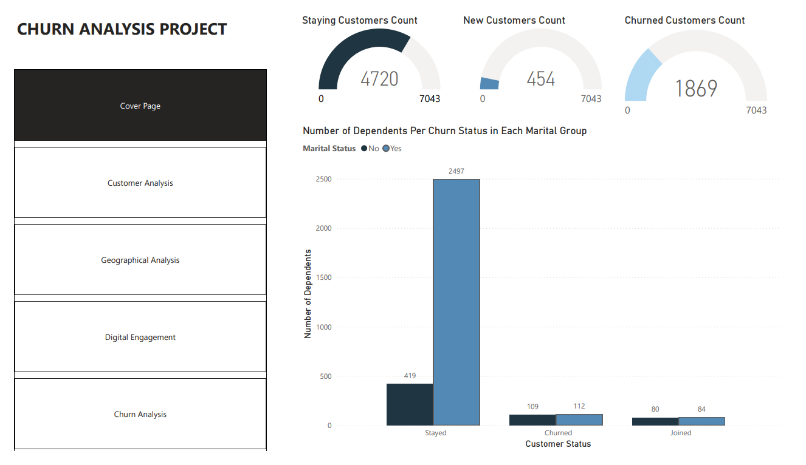
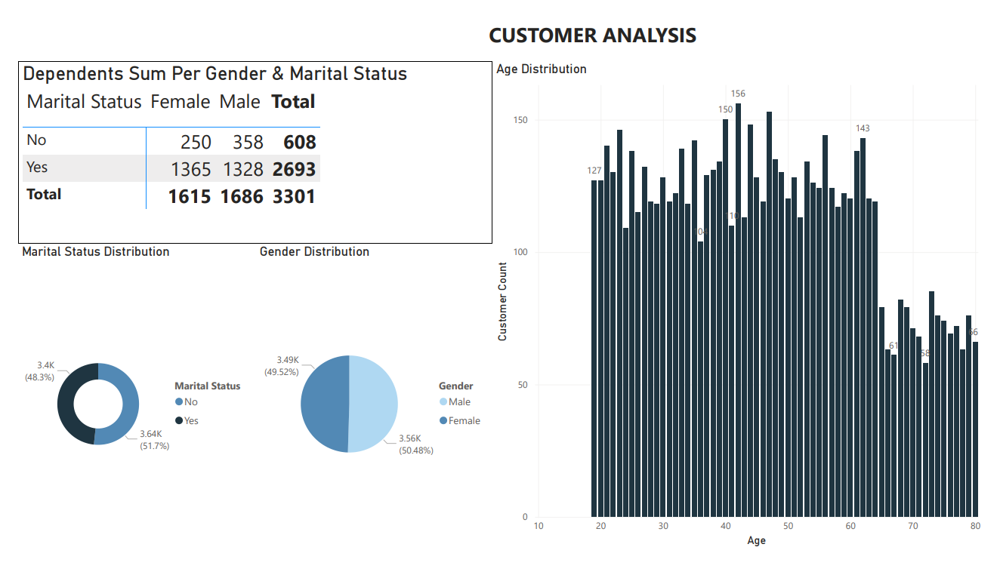
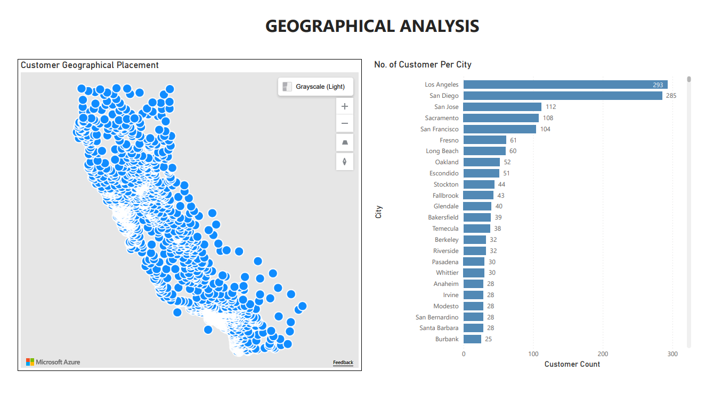
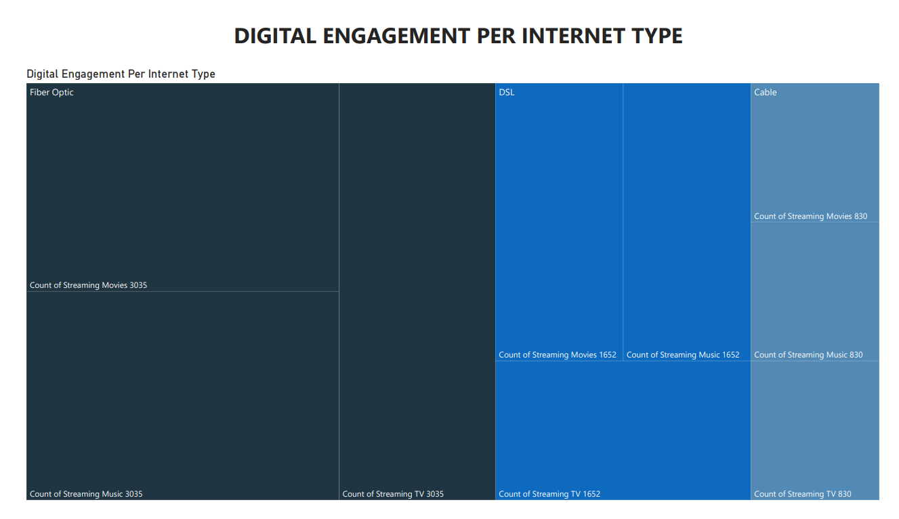
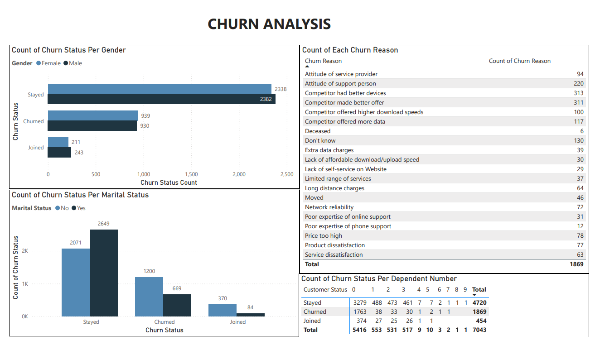

# The Analyst’s Field Notes  
## Field Note 01: Customers Don’t Churn Because of Outages 
**Domain:** Telecommunications  
**Tools:** Excel & Power BI  

## 1. Project Overview: Objectives

**Objective:**  
The goal of this project is to analyze how customer-experienced service quality; as reflected through complaints, resolution times, and repeat issues influence churn in a telecommunications environment. By examining these factors, we aim to uncover actionable insights that can guide retention strategies and improve overall customer satisfaction.

**Sub-objectives:**  
1. Identify which types of service issues have the strongest correlation with churn.  
2. Understand the impact of resolution speed and repeat issues on customer retention.  
3. Explore patterns across customer segments (tenure, plan type, billing) that may inform proactive retention initiatives.  
4. Build a repeatable analysis workflow in Excel and Power BI that demonstrates practical, enterprise-ready analytical skills.  

**Expected Outcome:**  
- A clear understanding of which service issues most strongly impact churn.  
- A set of actionable recommendations for improving customer experience.  
- Visual and quantitative evidence that emphasizes perceived service quality over technical KPIs.

## 2. Background: Problem Study & Context

Customer churn is one of the most critical metrics for telecommunications providers. Despite heavy investment in network infrastructure and operational excellence, organizations continue to face significant retention challenges. Technical service metrics (e.g., packet loss, latency, network uptime) are often monitored closely; however, the customer experience lens frequently reveals a different story.  

Customers perceive service quality not through the lens of raw network performance, but through interactions that impact them directly: the frequency of issues, the time taken to resolve them, and whether issues repeat. Understanding the human impact of operational issues is essential for designing effective retention strategies, optimizing support processes, and prioritizing business investments.

**Key Considerations:**  
- **Issue Types:** Common issues include outages, slow speeds, dropped calls, and billing errors.  
- **Customer Behavior:** Complaints, repeat issues, and slow resolution times can increase churn risk.  
- **Business Impact:** Every percentage point of churn reduction can represent substantial revenue preservation, particularly in high-value customer segments.  

This study intentionally focuses on **customer perception of service quality** rather than raw technical network metrics, providing a complementary perspective to operational monitoring.

## 3. Data Preprocessing 
### 3.1 Data Collection

**Data Sources:**  
- **Customer Subscription Data:** Includes customer ID, tenure, plan type, monthly charges, and churn status.  
- **Service Ticket Data:** Includes ticket ID, customer ID, issue type, number of tickets, resolution time (days), repeat issue flag, and date of occurrence.  

**Data Collection Notes:**  
- Customer data was sourced from publicly available telecom churn datasets (e.g., IBM/Kaggle Telecom Churn).
- Data source URL: https://mavenanalytics.io/data-playground/telecom-customer-churn?utm_source=chatgpt.com

- Service ticket data was simulated to reflect realistic complaint distributions and resolution patterns in the telecommunications industry. This ensures a credible foundation for customer experience analysis.  

### 3.2 Data Description
The dataset comprises **7,043 customers** from a telecommunications provider, capturing demographic, contractual, and churn-related information.

#### 1. Demographics

- **Gender Distribution:**  
  - Male: 3,555 (50.5%)  
  - Female: 3,488 (49.5%)  

- **Age Distribution:**  
  Customers range in age from 19 to 80. For analysis purposes, age groups are classified as follows:  
  - **Youth (19–30 years):** Young adults, likely early in their careers and more mobile.  
  - **Adult (31–50 years):** Mid-career customers with potentially stable usage patterns.  
  - **Senior (51–65 years):** Mature customers who may have different service expectations.  
  - **Elderly (66–80 years):** Older customers with potentially lower tech adoption rates.  

- **Marital Status:**  
  - Married: 3,403 (48.4%)  
  - Single: 3,641 (51.6%)  

- **Number of Dependents:**  
  Customers have between 0 to 9 dependents. This feature may indicate household size, potentially affecting service needs and churn behavior.

#### 2. Contractual Information

- **Contract Types:**  
  The dataset includes three contract categories, reflecting varying levels of commitment and billing arrangements. The types are Month-to-Month, One Year and Two Year.

- **Churn Information:**  
  Customer retention is captured through three categories:  
  - **Stayed:** 4,720 customers (67.0%)  
  - **Newly Joined:** 454 customers (6.5%)  
  - **Churned:** 1,869 customers (26.5%)  

This indicates that approximately **one in four customers left the service** during the observation period, highlighting the importance of understanding the drivers of churn.

#### 3. Observations

- Gender distribution is nearly balanced, making it suitable for analysis without significant bias.  
- The majority of customers are adults and mid-aged (31–50), but youth and elderly segments are present and may display distinct churn patterns.  
- Household size (dependents) varies widely and could be a factor in service usage and retention.  
- Contract type and tenure are expected to be significant variables in explaining churn behavior.  

### 3.3 Data Cleaning
The dataset was generally well-structured, with only minor inconsistencies that required attention. The cleaning process focused on **handling null values, standardizing columns, and ensuring data consistency**.

#### 1. Column Standardization

- Renamed the column `married` to `marital status` for clarity and consistency.  
- Verified all column names were clear, descriptive, and aligned with the analysis goals.

#### 2. Handling Null Values

Several fields contained missing values, which were handled as follows:

| Column | Issue | Cleaning Strategy |
|--------|-------|-----------------|
| `avg_monthly_long_distance` | Blank cells | Replaced nulls with `0`, assuming no long distance usage |
| `multiple_lines` | Blank cells | Replaced nulls with `No`, indicating the customer does not have multiple lines |
| `internet_type` | Blank cells | Replaced nulls with `None`, since customers without internet do not have associated services such as online security, online backup, device protection, premium tech support, streaming services, or unlimited data |

#### 3. Status and Churn Fields

- `status`: Customers who `stayed` or `joined` had blank `Churn Category` and `Churn Reason` fields.  
- To standardize, these blanks were replaced with **`No Category`** for `Churn Category` and **`No churn reason`** for `Churn Reason`.  
- This ensures all rows have meaningful values, avoiding ambiguity during analysis.

### 4. Data Validation

- Checked **all numeric columns** for correct data types and ranges.  
- Confirmed **categorical fields** contained expected values.  
- Ensured **derived and dependent fields** (e.g., features dependent on `internet_type`) were consistent.  

### 3.4 Data Normalization and Table Structure

In order to analyze customer behavior, subscription patterns, and churn, the dataset has been normalized into six related tables. This approach reduces redundancy, improves clarity, and supports scalable analysis.

#### 1. Customer_Info
**Purpose:** Stores immutable demographic and household details for each customer.

| Column | Description |
|--------|------------|
| customer_id (PK) | Unique customer identifier; primary key |
| gender | Male / Female |
| age | Numeric |
| marital_status | Married / Single |
| num_dependents | 0–9 |
| city | City of residence |

#### 2. Location
**Purpose:** Stores geographic information for mapping and location-based analysis.

| Column | Description |
|--------|------------|
| customer_id (FK) | Links to Customer_Info |
| city | City name |
| zip_code | Postal code |
| latitude | Decimal for GIS mapping |
| longitude | Decimal for GIS mapping |

#### 3. Digital_Engagement
**Purpose:** Captures the customer’s digital behavior and service usage footprint.

| Column | Description |
|--------|------------|
| customer_id (FK) | Links to Customer_Info |
| streaming_tv | Yes / No |
| streaming_movies | Yes / No |
| streaming_music | Yes / No |
| unlimited_data | Yes / No |

#### 4. Subscription
**Purpose:** Captures all service packages the customer has opted for.

| Column | Description |
|--------|------------|
| customer_id (FK) | Links to Customer_Info |
| tenure_months | Duration of service in months |
| offer | Active offer or promotion |
| phone_service | Yes / No |
| multiple_lines | Yes / No |
| internet_service | Yes / No |
| internet_type | Cable/ DSL / Fiber Optic / None |
| avg_monthly_gb | Average monthly data usage |
| online_security | Yes / No |
| online_backup | Yes / No |
| device_protection_plan | Yes / No |
| premium_tech_support | Yes / No |

#### 5. Billing
**Purpose:** Contains all financial and payment information.

| Column | Description |
|--------|------------|
| customer_id (FK) | Links to Customer_Info |
| contract | Month-to-Month / One-Year / Two-Year |
| paperless_billing | Yes / No |
| payment_method | Credit Card / Bank Withdrawal / Mailed Check |
| monthly_charges | Monthly billing amount |
| total_charges | Lifetime charges |
| total_refunds | Total refunds issued |
| total_extra_data_charges | Overage data fees |
| total_long_distance_charges | Additional phone charges |
| total_revenue | Total revenue generated |

#### 6. Customer_Status
**Purpose:** Tracks customer retention, churn, and related metadata.

| Column | Description |
|--------|------------|
| customer_id (FK) | Links to Customer_Info |
| status | Active / Churned / Joined |
| churn_category | Churn group |
| churn_reason | Reason for churn (optional) |

### 4. Data Visualization and Exploratory Analysis

Following data cleaning and preprocessing, a multi-page interactive dashboard was developed to explore customer demographics, engagement patterns, geographic distribution, and churn behavior. The dashboard consists of five analytical pages, each designed to answer a specific business question.

## Page 1: Cover Page – Customer Status Overview

### Visuals Included
- Customer status counts (Stayed, Churned, Joined)
- Number of dependents per churn status, segmented by marital status

### Description
Out of 7,043 customers, the majority remained with the service provider, while a significant portion churned and a smaller group joined. The dependents-by-status visualization shows clear variation across marital groups, with married customers—particularly those with dependents—more frequently represented among customers who stayed.

### Insight
This page establishes the core retention challenge and introduces household composition as a potential factor influencing churn behavior.

## Page 2: Customer Analysis – Demographics and Household Structure

### Visuals Included
- Gender distribution
- Marital status distribution
- Age distribution
- Sum of dependents by gender and marital status

### Description
The customer base is nearly evenly split by gender, with females accounting for 49.52% and males 50.48%. Marital status distribution is similarly balanced, with 51.7% married and 48.3% unmarried customers.

Among unmarried customers with dependents, 250 are female and 358 are male. Married customers account for a significantly larger share of dependents, with 1,365 females and 1,328 males. Age distribution shows customers spread across multiple life stages.

### Insight
Household responsibility, particularly among married customers, appears more concentrated and may contribute to higher service stability and retention.

## Page 3: Geographical Analysis – Customer Distribution

### Visuals Included
- Geographic map of customer locations
- Customer count by city

### Description
Customers are distributed across multiple cities, with visible clustering in specific urban areas. The city-level visualization highlights where the service provider’s customer base is most concentrated.

### Insight
Geographic concentration presents opportunities for targeted marketing, infrastructure investment, and region-specific service optimization.

## Page 4: Digital Engagement Analysis

### Visuals Included
- Digital engagement metrics segmented by internet type

### Description
Engagement with digital services such as streaming, security features, and data usage varies significantly by internet type. Customers without internet services show minimal or no digital engagement, while broadband users demonstrate higher adoption of digital features.

### Insight
Digital service adoption is closely tied to internet availability and quality, suggesting that bundled digital offerings may influence perceived customer value.

## Page 5: Churn Analysis – Drivers and Patterns

### Visuals Included
- Churn count by churn reason
- Churn status by marital status
- Churn status by gender
- Churn status by number of dependents

### Description
Churn reasons vary in frequency, indicating multiple drivers behind customer attrition. Higher churn rates are observed among unmarried customers and those with fewer or no dependents. Customers with greater household responsibility show stronger retention.

### Insight
Churn behavior is influenced by a combination of demographic, household, and service-related factors rather than a single dominant cause.

## Summary

The dashboard demonstrates that customer churn is not random but systematically related to customer demographics, household composition, digital engagement, and service characteristics. These insights support a customer-centric retention strategy focused on service quality, perceived value, and life-stage alignment.

### 5. Churn Analysis: Demographic Patterns and Drivers

This section examines churn behavior across demographic groups and explores the primary reasons customers discontinue service.

#### 5.1 Churn Patterns by Demographics

##### 5.1.1 Gender
The analysis indicates that churn is higher among female customers compared to male customers.

**Interpretation:**  
This difference may reflect variations in customer expectations, service sensitivity, or responsiveness to changes in service quality and support experiences. It does not imply causation but highlights a segment that may require more targeted engagement and support strategies.

##### 5.1.2 Marital Status
Single customers demonstrate higher churn rates compared to married customers.

**Interpretation:**  
Married customers may exhibit stronger retention due to household-level service dependencies and a higher perceived cost of switching providers. Single customers may face fewer logistical constraints, making provider changes more feasible.

##### 5.1.3 Number of Dependents
Customers with no dependents are significantly more likely to churn than customers with one or more dependents.

**Interpretation:**  
Household responsibility appears to be a stabilizing factor. Customers with dependents may prioritize continuity of service and reliability, reducing their likelihood of switching providers.

#### 5.2 Churn Reasons Analysis

An examination of churn reasons reveals that customer attrition is driven by a combination of competitive, service-related, and experience-based factors.

#### Key Churn Drivers
- **Competitive offerings:** Customers are drawn to competitors offering more attractive pricing, product bundles, or perceived value.
- **Customer support experience:** Negative interactions with support staff and perceived poor service attitudes contribute to churn.
- **Pricing concerns:** Dissatisfaction with pricing structures remains a major factor.
- **Network reliability:** Service instability and performance issues influence customer decisions to leave.
- **Lack of effective self-service:** Customers report frustration with unavailable or poorly functioning self-service platforms.
- **Limited service offerings:** A narrow range of services reduces perceived value.
- **Insufficient internet performance:** Inadequate download and upload speeds affect customer satisfaction.
- **Online support expertise:** Poor technical knowledge or resolution capability further compounds customer frustration.

#### 5.3 Observation

While some customers cite “just left” as a churn reason, this category likely represents underlying dissatisfaction rather than spontaneous decisions. Switching service providers typically involves effort and disruption, suggesting that churn is often the result of accumulated negative experiences rather than a single event.

#### 5.4 Key Insight

Customer churn is multifactorial and rarely driven by a single issue. Competitive pressure, service quality, support experience, and digital self-service effectiveness collectively shape customer decisions. Addressing churn therefore requires a holistic strategy focused on both technical performance and customer experience.

### 6. Business Implications
The churn analysis highlights several strategic and operational implications for the service provider. These findings demonstrate that customer retention is influenced by a combination of demographic factors, service experience, and competitive dynamics. Addressing churn therefore requires a coordinated approach across customer experience, product design, support operations, and network performance.

#### 1. Retention Represents a Larger Value Opportunity Than Acquisition

The imbalance between churned customers and newly acquired customers indicates that customer losses are not being sufficiently offset by acquisition efforts. This pattern suggests that current growth strategies may be inefficient if underlying retention issues remain unresolved.

**Business Impact:**  
High churn increases acquisition costs, reduces customer lifetime value, and places continuous pressure on marketing and sales functions.

**Implication:**  
Shifting strategic focus toward retention—through loyalty programs, proactive service interventions, and churn prediction can deliver more sustainable revenue outcomes than acquisition-led growth alone.

#### 2. Customer Life Stage Influences Retention Behavior

Lower churn rates among married customers and those with dependents suggest that household stability is a strong predictor of retention. Conversely, single customers and those without dependents exhibit greater mobility and switching behavior.

**Business Impact:**  
A one-size-fits-all retention strategy may fail to address the needs of higher-risk customer segments.

**Implication:**  
Customer segmentation strategies should incorporate life-stage indicators. Flexible contracts, targeted pricing options, and tailored engagement strategies may be more effective for higher-risk segments, while stability-focused offerings may better serve lower-risk households.

#### 3. Customer Experience Is a Competitive Differentiator

The presence of support-related churn reasons indicates that customer experience failures such as negative interactions with service representatives or poor issue resolution can outweigh technical service performance.

**Business Impact:**  
Poor customer experience erodes trust and accelerates churn, even when core services are technically adequate.

**Implication:**  
Investments in support training, service culture, and customer interaction quality can produce measurable improvements in retention. Customer experience metrics should be monitored alongside traditional operational KPIs.

#### 4. Digital Self-Service Quality Directly Affects Customer Satisfaction

Frustration with self-service platforms and limited online support capability contribute to customer dissatisfaction. Ineffective digital channels increase customer effort and reliance on in-store or call-center support.

**Business Impact:**  
Poor self-service functionality raises operational costs and negatively impacts customer perception.

**Implication:**  
Improving the reliability, usability, and resolution capability of digital self-service platforms can reduce customer effort, lower support costs, and improve overall customer satisfaction.

#### 5. Technical Performance Remains a Foundational Expectation

Churn related to network reliability, internet speeds, and service quality confirms that technical performance remains a baseline requirement rather than a differentiator.

**Business Impact:**  
Service disruptions and performance limitations undermine customer trust and amplify dissatisfaction across other touchpoints.

**Implication:**  
Network investments should be prioritized based on customer density and churn risk, ensuring that technical improvements align with customer impact rather than purely operational metrics.

#### 6. Churn Is Often the Result of Accumulated Dissatisfaction

The data suggests that customers rarely churn due to a single isolated issue. Instead, churn appears to result from repeated friction across pricing, service experience, support quality, and performance.

**Business Impact:**  
Delayed intervention reduces the likelihood of successful retention once dissatisfaction reaches a tipping point.

**Implication:**  
Early warning indicators such as frequent support interactions, declining engagement, or repeated service complaints should be leveraged to identify at-risk customers and trigger proactive retention actions.

### 7. Competitive Pressure Requires Value-Based Differentiation
Competitor driven churn highlights the importance of perceived value, not just price competitiveness. Customers respond to bundled offerings, service quality, and overall experience.

**Business Impact:**  
Price driven competition can compress margins without guaranteeing long-term loyalty.

**Implication:**  
Differentiation strategies should emphasize value through service reliability, customer experience, and bundled offerings rather than competing solely on price.

### 7. Recommendations  
Based on the insights derived from the churn and customer behavior analysis, the following recommendations are proposed to reduce churn, improve customer experience, and strengthen long-term customer retention. These recommendations prioritize high impact areas identified within the data and are aligned with both operational feasibility and strategic business objectives.

#### 1. Implement Proactive Churn Risk Monitoring

Customers who are single, have no dependents, and show declining engagement patterns represent the highest churn risk segment. Waiting until customers initiate cancellation limits the effectiveness of retention efforts.

**Recommendation:**  
Develop a churn risk scoring framework using demographic indicators, service usage patterns, and support interaction frequency. This framework can be used to trigger proactive outreach, targeted offers, or service interventions before churn occurs.

**Expected Impact:**  
- Reduced voluntary churn  
- Improved customer lifetime value  
- Better allocation of retention resources  

#### 2. Strengthen Customer Support Quality and Accountability

Support related dissatisfaction is a notable contributor to churn. Poor service interactions can negate otherwise competitive pricing and product offerings.

**Recommendation:**  
Invest in customer support training, emphasizing issue ownership, empathy, and resolution quality. Introduce performance metrics tied to customer satisfaction rather than call handling time alone.

**Expected Impact:**  
- Improved customer trust and loyalty  
- Lower churn driven by service experience  
- Enhanced brand perception  

#### 3. Improve Digital Self-Service Platforms

Frustration with self-service capabilities indicates that customers value independence but are hindered by unreliable or ineffective tools.

**Recommendation:**  
Enhance self-service platforms to ensure reliability, clarity, and full issue resolution capability. Key focus areas should include account management, troubleshooting, and service modification without requiring in-store or call-center intervention.

**Expected Impact:**  
- Reduced customer effort  
- Lower operational support costs  
- Improved customer satisfaction scores  

#### 4. Align Pricing and Offers with Customer Segments

Competitor-driven churn highlights the sensitivity of customers to perceived value rather than price alone.

**Recommendation:**  
Introduce targeted pricing models and bundled offerings based on customer segments. For example, flexible short-term contracts for single customers and stability-focused packages for families and long-term customers.

**Expected Impact:**  
- Increased price competitiveness  
- Improved retention among high-risk segments  
- Stronger value perception  

#### 5. Prioritize Network Reliability in High-Risk Areas

Technical performance issues such as network reliability and speed continue to influence customer dissatisfaction and churn.

**Recommendation:**  
Use geographical churn patterns to prioritize network upgrades in high-density and high-churn regions. Align technical investments with customer impact metrics rather than purely infrastructure-based priorities.

**Expected Impact:**  
- Reduced churn driven by service quality issues  
- Improved customer experience in critical locations  
- Stronger competitive positioning  

#### 6. Introduce Early Intervention Customer Engagement Programs

The analysis suggests that churn often results from cumulative dissatisfaction rather than isolated incidents.

**Recommendation:**  
Implement engagement programs for customers showing early signs of dissatisfaction, such as repeated service issues or declining usage. These programs may include personalized communication, service check-ins, or loyalty incentives.

**Expected Impact:**  
- Earlier issue resolution  
- Higher retention success rates  
- Increased customer loyalty  

#### 7. Continuously Monitor and Refine Retention Strategies
Customer behavior and market dynamics evolve over time, requiring continuous reassessment of retention strategies.

**Recommendation:**  
Establish a recurring review process using churn metrics, customer feedback, and service performance indicators to refine retention initiatives and adapt to changing customer needs.

**Expected Impact:**  
- Data-driven decision-making  
- Improved long-term retention outcomes  
- Greater organizational agility  

### 8. Assumptions & Limitations

- The analysis assumes that all customer records represent a single point in time and do not capture longitudinal behavior.
- Churn reasons are based on reported categories and may not fully capture underlying customer motivations.
- Demographic attributes are assumed to be accurate and self-reported without verification.
- The dataset does not include qualitative customer feedback, which limits interpretation of sentiment-related drivers.
- External market factors such as regional competition intensity and economic conditions were not included in the analysis.

### 9. Key Metric Definitions

- **Churned Customer:** A customer whose status is recorded as having left the service provider.
- **Joined Customer:** A newly acquired customer within the reporting period.
- **Stayed Customer:** A customer who remained with the service provider during the reporting period.
- **Dependents:** The number of individuals financially or contractually associated with the customer.
- **Digital Engagement:** Customer usage of digital services such as streaming platforms and online service features.

### 10. Tools & Technologies

- Microsoft Excel: data cleaning, transformation, and validation
- Power BI: data modeling, visualization, and dashboard development